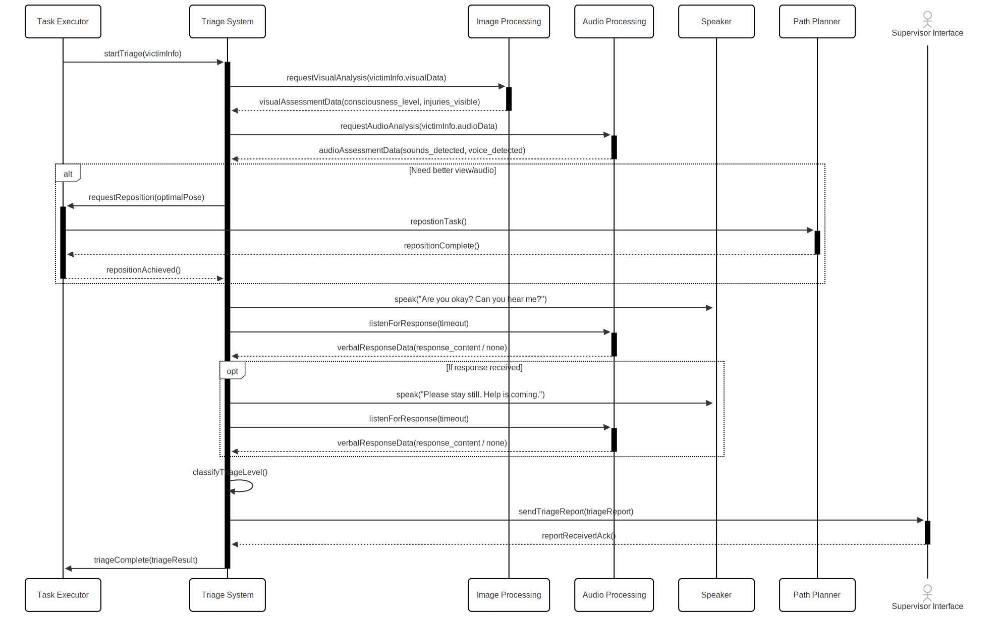

Architecture
=============

Component Diagram
------------------

The component diagram illustrates the overall structure of the Cognitive Architecture system, which is designed for rescue operations in disaster scenarios. The architecture follows a modular approach with clear separation of concerns, allowing components to be developed, tested, and maintained independently.

.. figure:: images/ComponentDiagram.svg
   :align: center
   :alt: Component Diagram

   Component diagram of the CogAR system

Design Patterns in the Architecture
^^^^^^^^^^^^^^^^^^^^^^^^^^^^^^^^^^^^

The following design patterns are recommended for implementation within the architecture:

1. **Observer Pattern**: Used in the communication between the Task Executor and other components (TriageSystem, StructuralRiskAssessment, VictimDetectionAndReporting). Components subscribe to task updates and act upon them.

2. **Strategy Pattern**: Implemented in the TriageSystem where different triage classification algorithms can be swapped based on scenario requirements without changing the core functionality.

3. **Facade Pattern**: The Perception module (SensorFusion) acts as a facade, simplifying access to complex subsystems like Image Processing, Object Detection, and Point Cloud Processing.

4. **Command Pattern**: Used in TaskExecutor to encapsulate task requests as objects, allowing for queuing, prioritization, and cancellation of tasks.

5. **Decorator Pattern**: Could be applied to add additional risk assessment capabilities to the StructuralRiskAssessment component without modifying its core code.

Behavioral Diagrams
-------------------

TriageSystem Sequence Diagram
^^^^^^^^^^^^^^^^^^^^^^^^^^^^

   Sequence diagram for the TriageSystem

The TriageSystem sequence diagram illustrates the interaction between the TriageSystem component and other system components during a victim triage operation. Key aspects of this behavior include:

1. **Task Initiation**: The sequence begins with the TaskExecutor initiating a triage task.

2. **Data Collection**: The TriageSystem requests and receives visual and audio data from the respective processing components.

3. **Victim Interaction**: The system engages with potential victims through the Speaker component, asking if they are okay and waiting for responses.

4. **Classification**: Based on collected data and responses, the TriageSystem classifies the victim's condition.

5. **Reporting**: The classification is sent back to the TaskExecutor, completing the triage process.

This sequence was chosen because it effectively demonstrates the collaborative nature of the system components while maintaining a clear separation of concerns. Each component has a specific responsibility, and their interactions are well-defined, facilitating system maintenance and expansion.

StructuralRiskAssessment Activity Diagram
^^^^^^^^^^^^^^^^^^^^^^^^^^^^^^^^^^^^^^^^^^

.. figure:: images/StructuralRiskAssessment.svg
   :align: center
   :alt: Structural Risk Assessment Activity Diagram

   Activity diagram for the StructuralRiskAssessment

The StructuralRiskAssessment activity diagram depicts the workflow for assessing structural risks in disaster environments. Key elements include:

1. **Parallel Processing**: Multiple data streams (force-torque, vision, sensor fusion) are processed simultaneously.

2. **Risk Classification**: Various risk factors are aggregated and classified to determine an overall risk level.

3. **Decision Points**: Based on the risk level, different actions are taken, such as sending alerts or requesting robot repositioning.

4. **Continuous Monitoring**: The process operates in a continuous loop, constantly reassessing risk as new data arrives.

This activity diagram was selected because it clearly illustrates the complex decision-making process involved in risk assessment, showing both the parallel processing of multiple inputs and the sequential decision logic that follows. The activity diagram effectively communicates how the component handles different scenarios and prioritizes safety in hazardous environments.

Component Interfaces
--------------------     

Task Assessment Components
^^^^^^^^^^^^^^^^^^^^^^^^^^

**TaskExecutor**

* **Interface Type**: Service-oriented, Stateful
* **Publishers**:
  - `/task_executor/task`: Broadcasts the current task being executed (strongly-typed)
  - `/task_status`: Publishes status updates of current tasks (strongly-typed)
* **Subscribers**:
  - `/task_executor/requests`: Receives task requests from other components (strongly-typed)
  - `/mission_planner`: Receives high-level mission directives (strongly-typed)
* **Interface Characteristics**: Acts as a central coordinator, maintaining state about current tasks, priorities, and execution status. Follows a service-oriented paradigm where it processes requests and manages task lifecycle.

**TriageSystem**

* **Interface Type**: Data-oriented, Stateless
* **Publishers**:
  - `/triage/classification`: Publishes victim triage classifications (strongly-typed)
* **Subscribers**:
  - `/task_executor/task`: Receives task assignments (strongly-typed)
  - `/perception/processed_audio`: Receives processed audio data for victim detection (loosely-typed)
  - `/perception/image_processing`: Receives processed image data for victim assessment (loosely-typed)
* **Services Called**:
  - `Speaker`: Requests the system to speak to potential victims
* **Interface Characteristics**: Primarily processes incoming data streams and produces classifications. Stateless in nature, where each classification depends only on current inputs without maintaining history.

**StructuralRiskAssessment**

* **Interface Type**: Data-oriented, Stateful
* **Publishers**:
  - `/risk_alert`: Publishes immediate risk alerts (strongly-typed)
  - `/risk_level`: Publishes ongoing risk assessment levels (strongly-typed)
  - `/task_executor/requests`: Requests new tasks based on risk assessment (strongly-typed)
* **Subscribers**:
  - `/wrist_right_ft`: Receives force-torque sensor data (strongly-typed)
  - `/perception/sensor_fusion`: Receives fused sensor data (strongly-typed)
  - `/task_executor/task`: Receives task assignments (strongly-typed)
  - `/perception/image_processing`: Receives processed image data (loosely-typed)
* **Interface Characteristics**: Maintains state regarding ongoing risk assessments, environmental conditions, and historical data to provide context-aware risk analysis.

**VictimDetectionAndReporting**

* **Interface Type**: Data-oriented, Stateful
* **Publishers**:
  - `/victim_detection/alert`: Publishes victim detection alerts (strongly-typed)
  - `/victim_detection/location`: Publishes victim location data (strongly-typed)
* **Subscribers**:
  - `/perception/processed_audio`: Receives processed audio for victim detection (loosely-typed)
  - `/slam/estimated_state`: Receives robot pose data (strongly-typed)
  - `/task_executor/task`: Receives task assignments (strongly-typed)
  - `/perception/image_processing`: Receives processed image data (loosely-typed)
* **Interface Characteristics**: Stateful as it tracks detected victims and their locations over time. Integrates various data sources to build and maintain a victim map.

Perception Components
^^^^^^^^^^^^^^^^^^^^^^

**SensorFusion**

* **Interface Type**: Data-oriented, Stateless
* **Publishers**:
  - `/perception/sensor_fusion`: Publishes fused sensor data (strongly-typed)
* **Subscribers**:
  - `/perception/image_processing`: Receives processed image data (loosely-typed)
  - `/perception/object_detection`: Receives object detection data (strongly-typed)
  - `/perception/point_cloud`: Receives point cloud data (strongly-typed)
* **Interface Characteristics**: Acts as an aggregation point for multiple data streams, processing them into a unified representation. Stateless as it operates on current sensor data without maintaining history.

**ImageProcessing**

* **Interface Type**: Data-oriented, Stateless
* **Publishers**:
  - `/perception/image_processing`: Publishes processed image data (loosely-typed)
* **Subscribers**:
  - Raw camera input
* **Interface Characteristics**: Focuses on transforming raw image data into more useful formats. Stateless, processing each frame independently.

**AudioProcessing**

* **Interface Type**: Data-oriented, Stateless
* **Publishers**:
  - `/perception/processed_audio`: Publishes processed audio data (loosely-typed)
* **Subscribers**:
  - Raw audio input
* **Interface Characteristics**: Transforms raw audio signals into meaningful data. Stateless, processing each audio segment independently.

Navigation Components
^^^^^^^^^^^^^^^^^^^^^^

**PathPlanner**

* **Interface Type**: Service-oriented, Stateful
* **Publishers**:
  - `/path_planner/setpoint`: Publishes the planned path as a setpoint (strongly-typed)
* **Subscribers**:
  - `/slam/estimated_state`: Receives the robot's current pose from SLAM (strongly-typed)
  - `/object_detection`: Receives detected object poses (strongly-typed)
  - `/task_executioner`: Receives task instructions (strongly-typed)
* **Interface Characteristics**: Maintains state regarding the robot's current position, task instructions, and object positions to generate appropriate path plans. Acts as a service provider for motion planning.

**SLAM (Simultaneous Localization and Mapping)**

* **Interface Type**: Data-oriented, Stateful
* **Publishers**:
  - `/slam/estimated_state`: Publishes the estimated state of the robot (strongly-typed)
* **Subscribers**:
  - `/sensor_fusion`: Receives sensor fusion data containing IMU and odometry information (strongly-typed)
* **Interface Characteristics**: Maintains an internal state that represents the robot's position in the environment and continuously updates this state based on incoming sensor data. Provides critical positional awareness to other system components.

Robot Control Components
^^^^^^^^^^^^^^^^^^^^^^^^^

**PlatformController**

* **Interface Type**: Data-oriented, Stateful
* **Publishers**:
  - `/motor_driver/left`: Publishes commands to the left motor (strongly-typed)
  - `/motor_driver/right`: Publishes commands to the right motor (strongly-typed)
* **Subscribers**:
  - `/sensor_fusion`: Receives sensor fusion data for feedback control (strongly-typed)
  - `/path_planner/setpoint`: Receives path setpoints to follow (strongly-typed)
* **Interface Characteristics**: Acts as the low-level controller that translates high-level path plans into motor commands. Maintains state regarding the current control objectives and sensor feedback to implement closed-loop control.

Integration Considerations
--------------------------

The architecture's design emphasizes loose coupling between components through well-defined interfaces, primarily using ROS topics for communication. This approach offers several advantages:

1. **Fault Isolation**: Issues in one component are less likely to cascade throughout the system.

2. **Independent Development**: Teams can work on different components simultaneously with minimal coordination overhead.

3. **Testing Flexibility**: Components can be tested in isolation using mock data publishers and subscribers.

4. **Scalability**: New components can be added to the system without modifying existing ones, as long as they adhere to the established communication protocols.

The selected behavioral diagrams demonstrate how these independently developed components work together to accomplish complex tasks in disaster response scenarios, providing both clarity for development and a foundation for system verification and validation.